# **囚徒健身（Convict Conditioning）**
##### *** 码农身体太虚，依照囚徒健身锻炼身体，强健体魄好码代码！***

> * ##### 学习 看资料（书、视频）
> * ##### 总结 读书笔记（Xmind、Markdown）
> * ##### 实践 随时随地进行练习

# *注意*
> #### 红色 动作相关
> #### 蓝色 通用相关

# *作者*
> #### 保罗-威德（Paul “Cocach” Wade）

# *书籍*
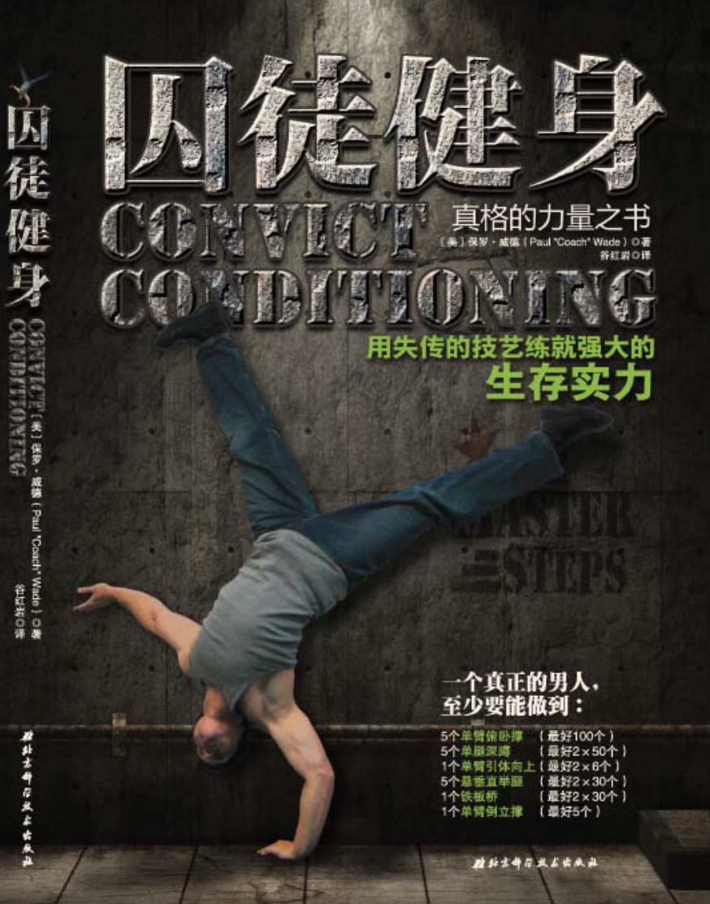

# *目标* 

# *语句摘录*
 * ##### 身体的智慧
 * ##### 中国人在人体运动方面发展出的精妙系统
 * ##### 运用自如的身体才配得上强壮二字
 * ##### 一无所有除了自己的身体和心灵
 * ##### 无论你被关在多么小的空间之内，无论外界环境如何，强化身体和心灵都是你的自由，任谁都无法剥夺的自由
 * ##### 对他们而言，锻炼就是一种信仰，一种生活方式
 * ##### 简单地说，体操是用自身体重与身体惯性锻炼身体的一种技艺
 * ##### 如果有谁想变得更强壮，终极方式就是根据升级原则用自身体重锻炼

# *心法*
> ### 安全锻炼
> ### 由易到难
> ### 循序渐进
> ### 稳扎稳打

# *1. 俯卧撑十式*
### 第一式 墙壁俯卧撑

#### *功效:*
###### *肘、腕、肩*

#### *动作*
###### 1. 面对墙壁站立，双脚并拢，双臂伸直，与肩同宽，双手平放在墙上，手掌与胸等高。（起始姿势）
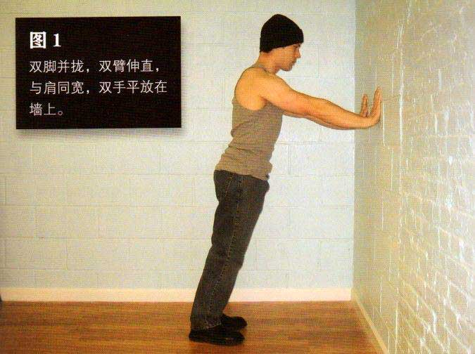
###### 2. 弯曲肘部，直到前额轻触墙面。（结束姿势）
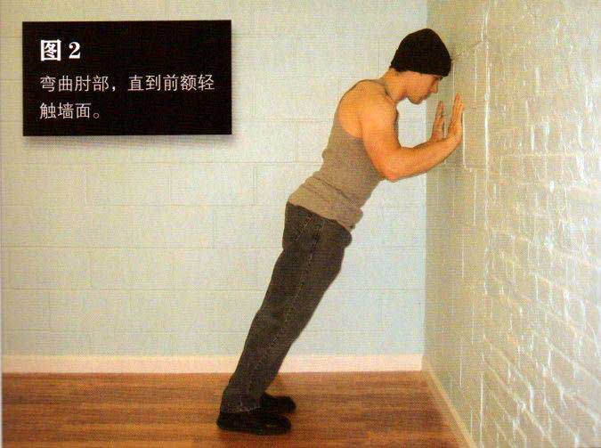
###### 3. 将自己推回到起始姿势，如此重复。

#### *训练目标*
###### 1. 初级标准：1 组，10 次
###### 2. 中级标准：2 组，各 25 次
###### 3. 高级标准：3 组，各 50 次

# *2. 深蹲十式*
### 第一式 肩倒立深蹲

#### *功效:*
###### *腿、上身、关节*

#### *动作*
###### 1. 平躺，双膝弯曲，双手下压，双脚蹬离地面，直到举到空中。在将双腿举起的过程中，顺势把双手撑在下背部，注意上臂要紧贴地面。靠双肩、上背部以及上臂支撑身体。始终用这几个部位支撑身体，不要让颈部受到压力。身体要锁定伸直，髋部不要弯曲。（起始姿势）
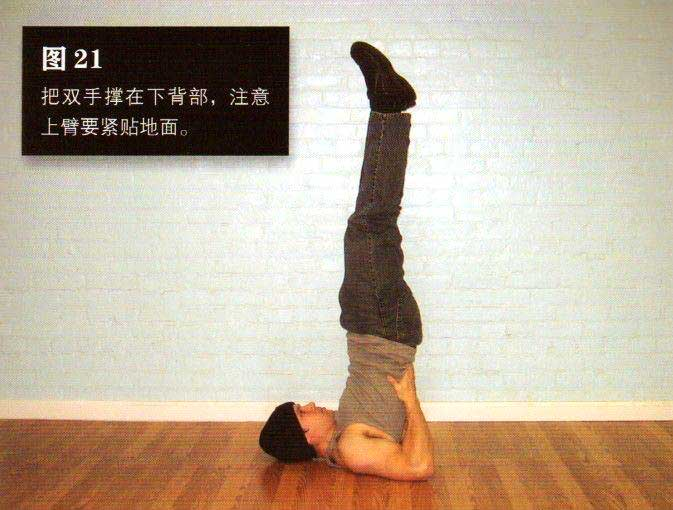
###### 2. 上半身要尽可能伸直，弯曲髋部与膝关节，直到膝盖轻触前额。（结束姿势）
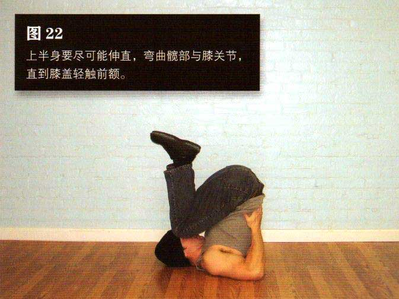
###### 3. 伸直双腿，直到身体回到起始姿势，如此重复。（重复姿势）

#### *训练目标*
###### 1. 初级标准：1 组，10 次
###### 2. 中级标准：2 组，各 25 次
###### 3. 高级标准：3 组，各 50 次

# *3. 引体向上十式*
### 第一式 垂直引体

#### *功效:*
###### *背部、手臂、肩部、肱二头肌、肘部*

#### *动作*
###### 1.找一个可抓握且很稳固的竖直物体，门框和高一点的栏杆都是上好之选。靠近物体站立，脚尖与之保持约8~15厘米的距离。以舒服的姿势抓住该物体，理想情况是双手与肩同宽，但不必要只要双手对称即可。（起始姿势）
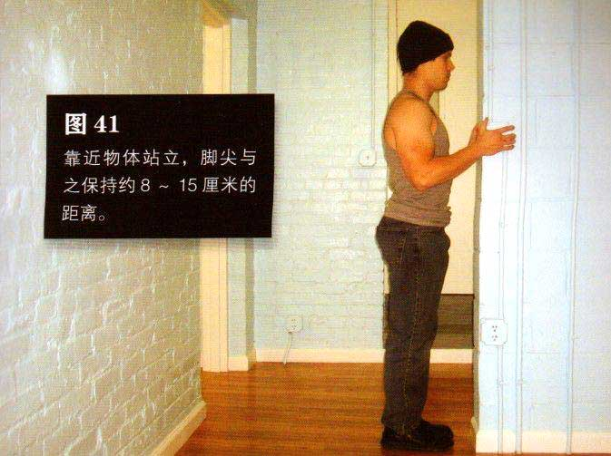
###### 2. 由于你距离物体很近，所以手臂会弯曲。身体慢慢向后倾，在此过程中伸展手臂，直到手臂几乎伸直、身体后倾与地面成一定角度为止。（结束姿势）
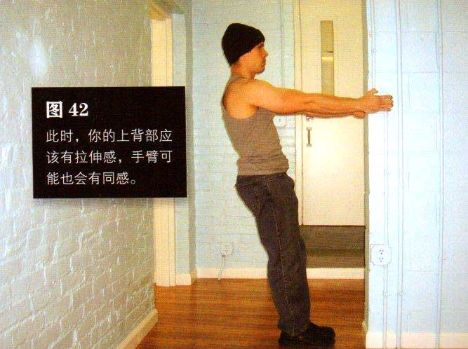
###### 3. 此时，你的上背部应该有拉伸感，手臂可能也会有同感。暂停一会，再并拢肩脚骨并弯曲手臂，把身体拉回到起始姿势。暂停，然后再重复该动作。(重复姿势)

#### *训练目标*
###### 1. 初级标准：1 组，10 次
###### 2. 中级标准：2 组，各 20 次
###### 3. 高级标准：3 组，各 40 次

# *4. 举腿十式*
### 第一式 坐姿屈膝

#### *功效:*
###### *背部、手臂、肩部、肱二头肌、肘部*

#### *动作*
###### 1.坐在椅子或床的边缘，身体略微向后倾斜，双手抓住边沿，两腿伸直，双脚并拢，脚跟距离地面几厘米。（起始姿势）
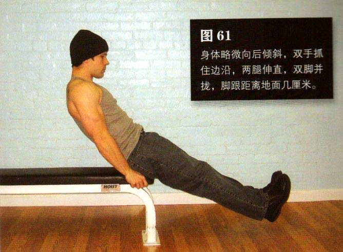
###### 2. 平缓地抬起膝盖，直到膝盖距胸部约15~25厘米。在此过程中呼气，动作完成时呼气结束，腹肌保持收缩状态。（结束姿势）
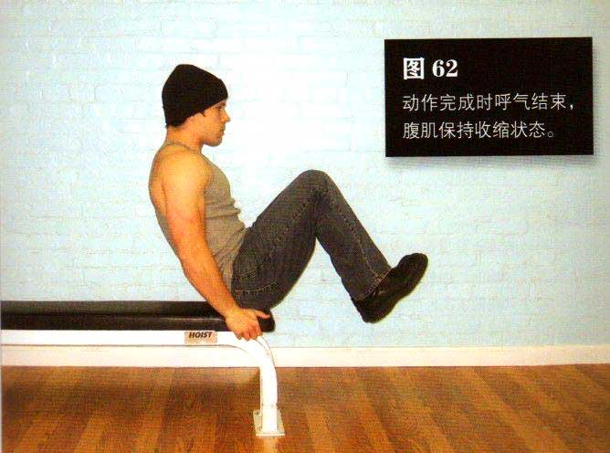
###### 3. 暂停1秒钟，进行反向运动并回到起始姿势。伸展膝盖的同时吸气。双脚应该始终沿着一条直线移动，而且始终保持悬空，直到一组动作完成方可接触地面。腹部要始终收缩，动作要慢，要抵制快速完成动作的冲动。如果需要，可以在两次动作之间喘几口气。 (重复姿势)

#### *注意:*
> ###### 1. 动作要平缓
> ###### 2. 呼吸节奏要正确
> ###### 3. 腹部始终要保持收紧状态

#### *训练目标*
###### 1. 初级标准：1 组，10 次
###### 2. 中级标准：2 组，各 25 次
###### 3. 高级标准：3 组，各 40 次

# *5. 桥十式*
### 第一式 短桥

#### *功效:*
###### *下肢、脊柱、髋部、肱二头肌、肘部*

#### *动作*
###### 1.躺在地上，双手叠放在腹部。膝盖弯曲，将双脚拉向臀部，直到胫骨与地面接近“垂直，此时脚跟距离臀部约 15~20 厘米，脚掌平放在地上。双脚与肩同宽或略窄，依个人舒适度而定。（起始姿势）
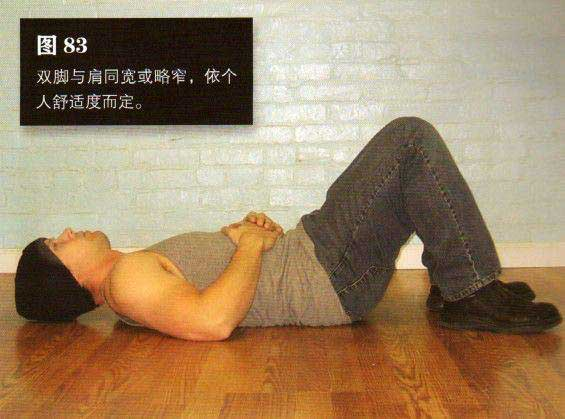
###### 2. 然后双脚用力下压，身体向上拱起，使髋部和背部离开地面，直到仅以双肩和双脚支撑整个身体。此时，大腿和躯干应成一条直线，髋部不要下沉。（结束姿势）
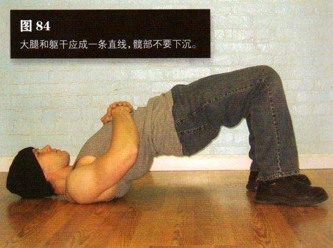
###### 3. 暂停一会，然后做反向动作，缓缓地放低身体，直到回到起始姿势，如此重复。身体撑起时呼气身体放低时吸气。(重复姿势)

#### *训练目标*
###### 1. 初级标准：1 组，10 次
###### 2. 中级标准：2 组，各 25 次
###### 3. 高级标准：3 组，各 50 次

# *6. 倒立撑*
### 第一式 靠墙顶立

#### *功效:*
###### *血管、内脏器官、头部、身体平衡、肩部*

#### *动作*
###### 1.找一堵墙，在墙根处放置一个枕头（坐垫或叠好的毛巾也可）。双手和双膝着地，将头顶在枕头上，头部距离墙壁约15 ~25厘米。双手稳稳地放在头部两侧，大约与肩同宽。抬起一条腿的膝盖，让其靠近同侧的肘部，同时伸直另一条腿，使膝盖离地。（起始姿势）
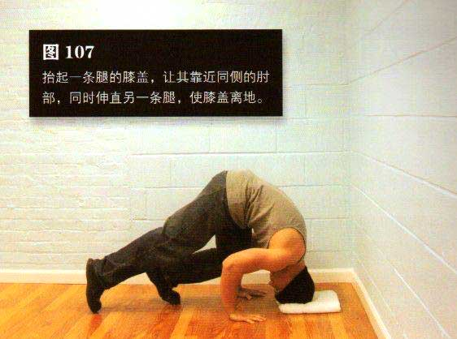
###### 2. 然后，让靠近肘部的腿使劲蹬地，同时将另一条腿向上踢，从而让两条腿同时靠向墙壁。一旦双脚靠在墙壁上，就慢慢伸直双腿，把身体摆正。（中途姿势）
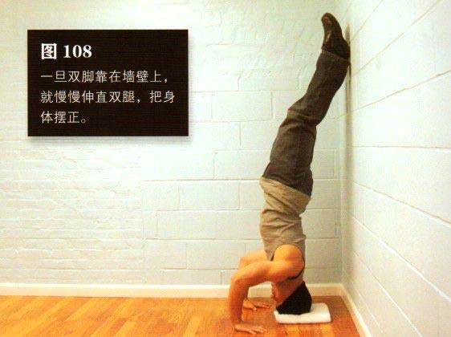
###### 3. 嘴巴保持闭合，用鼻子平缓呼吸。坚持所需时间后，弯曲双腿，并有控制地放下它们 。(结束姿势)

#### *训练目标*
###### 1. 初级标准：30秒
###### 2. 中级标准：1分钟
###### 3. 高级标准：2分钟
