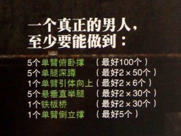

# **囚徒健身（Convict Conditioning）**

> * 学习 看资料（书、视频）
> * 总结 读书笔记（Xmind、Markdown）
> * 实践 在宿舍进行练习

***作者***
> * 保罗-威德（Paul “Cocach” Wade）

***申明***
> * 咨询医生
> * 安全锻炼
> * 安全为上

***书籍***

***目标***

### ***第一部分 预备***
#### 第一章 力量之旅

###### 力与美：
######如今：
* 器械
* 健身房
* 营养补剂：蛋白粉
* 健美运动员
* 药物：类固醇

###### 曾经：
* 自己的身体

###### 老派体操：自身体重锻炼、黑暗的地方

###### 师出何门

#### 第二章 失传的技艺“老派”体操

***语句摘录***

* 身体智慧
* 中国人在人体运动方面发展出的精妙系统
* 运用自如的身体才配得上强壮二字
* 一无所有除了自己的身体和心灵
* 无论你被关在多么小的空间之内，无论外界环境如何，强化身体和心灵都是你的自由，任谁都无法剥夺的自由
* 对他们而言，锻炼就是一种信仰，一种生活方式
* 简单地说，体操是用自身体重与身体惯性锻炼身体的一种技艺
* 如果有谁想变得更强壮，终极方式就是根据升级原则用自身体重锻炼
